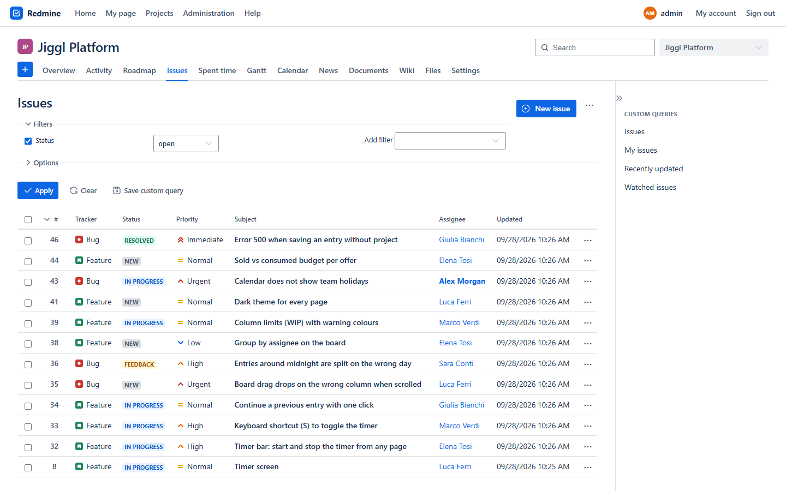
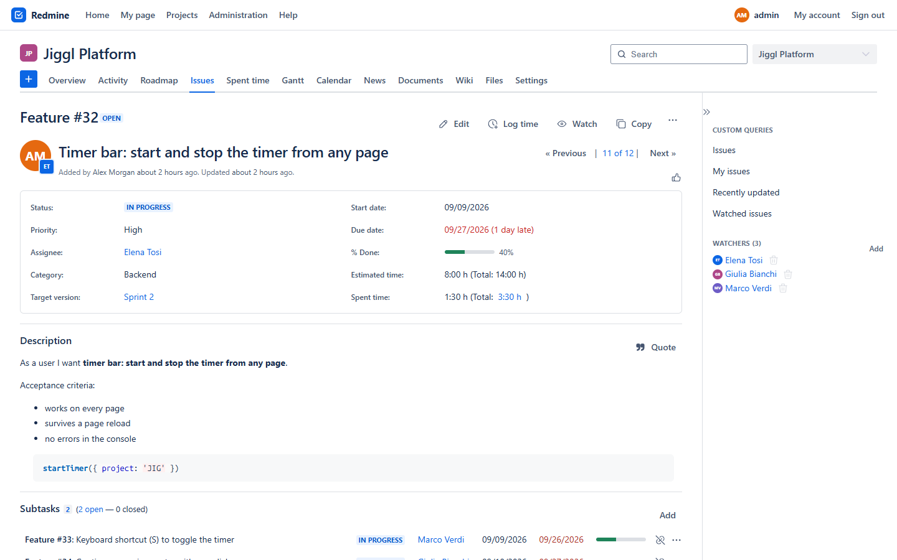
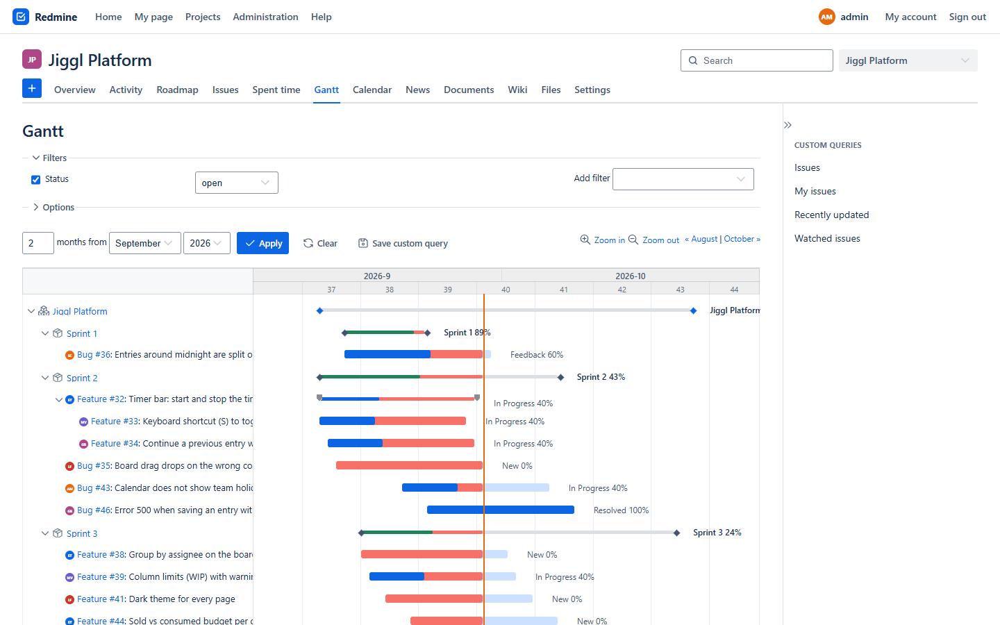
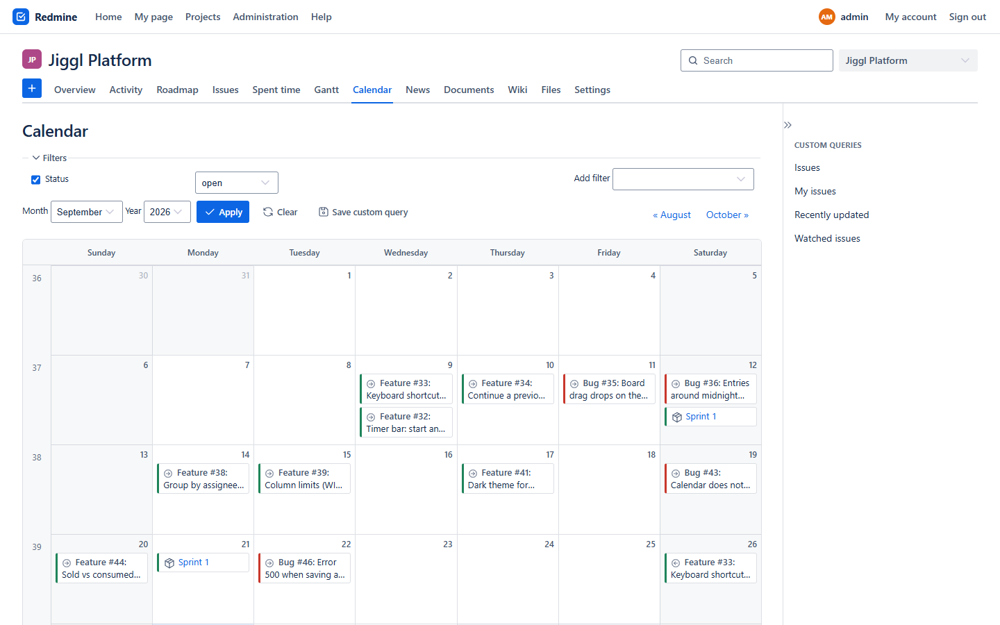
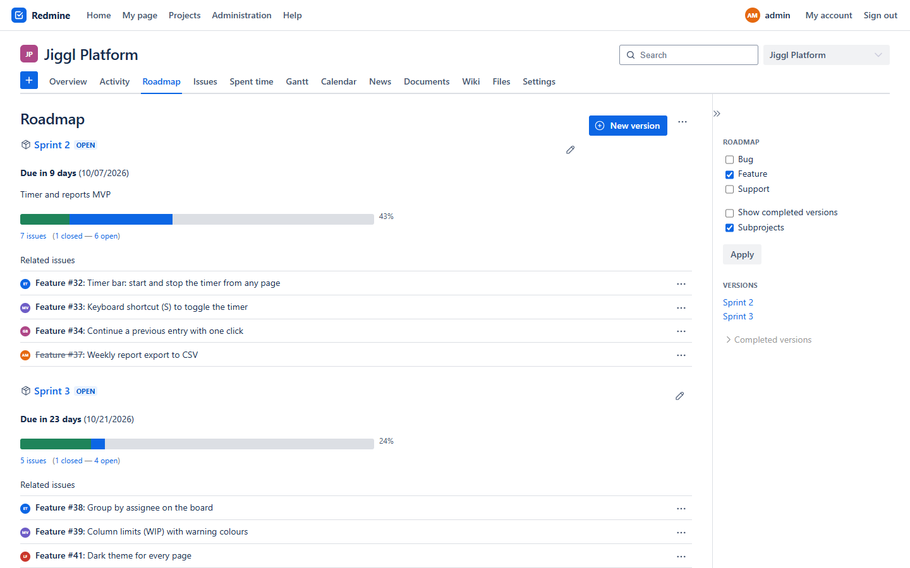
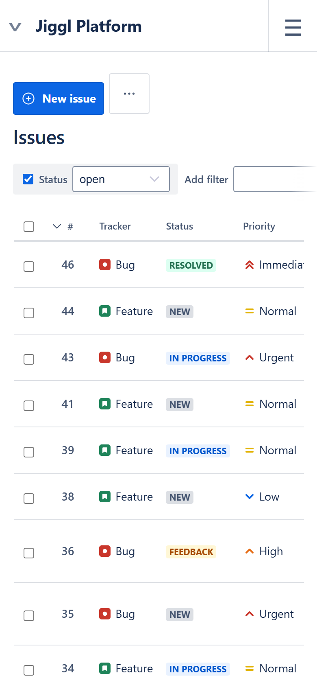
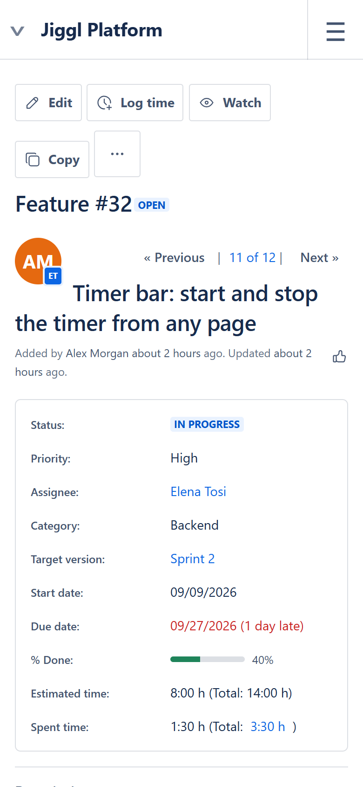

# Jiggl theme for Redmine

A clean, modern theme for [Redmine](https://www.redmine.org) 6: white surfaces, a flat top
bar, underlined tabs, coloured status lozenges, priority arrows and tracker icons, a
readable Gantt chart and a calendar that fills the page. It uses the same design language
as the Jiggl app.



| Issue | Gantt |
|---|---|
|  |  |
| **Calendar** | **Roadmap** |
|  |  |

<p>
  
  
</p>

## Features

- **Top bar and header**: flat white top bar with logo, current-page highlight and user
  avatar; project header with a coloured project avatar, search and project switcher;
  project menu as underlined tabs, with Redmine's "+" as a blue button.
- **Lists**: no zebra stripes, left-aligned columns, status lozenges, priority arrows,
  tracker icons, blue selection instead of Redmine's dark blue.
- **Issue page**: large subject, attributes in a details panel, history with avatars.
- **Forms and buttons**: 32px fields with a focus ring, primary actions in blue, subtle
  secondary buttons, borderless editor toolbar.
- **Gantt**: light grid, rows of 32px instead of 20px, flat rounded bars, diamond markers
  for versions and projects, an orange "today" line, and a chart that stretches to the
  full width of the page. Collapse/expand, relation arrows and progress lines keep working.
- **Calendar**: light grid, today highlighted, entries as small cards with a tracker
  stripe, weeks that fill the height of the window.
- **Phones**: Redmine's mobile layout, recoloured, with a white header and a dark flyout
  menu. Filters, "Options" and buttons sit on a single swipeable strip instead of
  stacking up; wide tables and the Gantt chart scroll sideways inside their box.
- The "Powered by Redmine" footer is hidden (see [Customising](#customising)).

## Requirements

- Redmine 6.x. Tested on **Redmine 6.1.4** (official Docker image). Redmine 5 and older are
  not supported: they load themes from a different folder and build assets differently.
- A recent browser (Chrome, Edge, Firefox or Safari).

## Installation

Redmine 6 looks for themes in the `themes/` folder of its installation. The folder name
becomes the theme name, so clone the repository as `themes/jiggl`:

```sh
cd /path/to/redmine
git clone https://github.com/zara-tec/redmine-jiggl-theme.git themes/jiggl
```

Then restart Redmine. On startup Redmine 6 rebuilds its assets when it detects changes
(`config.assets.redmine_detect_update`, on by default in production). If your setup turns
that off, run `bundle exec rake assets:precompile RAILS_ENV=production` before restarting.

Finally choose the theme in **Administration → Settings → Display → Theme → Jiggl**.

### Docker (official `redmine` image)

Mount a themes folder into the container and clone the theme into it:

```yaml
services:
  redmine:
    image: redmine:6
    volumes:
      - ./themes:/usr/src/redmine/themes:ro
```

```sh
git clone https://github.com/zara-tec/redmine-jiggl-theme.git themes/jiggl
docker compose up -d        # or: docker restart <redmine container>
```

### Updating

```sh
cd themes/jiggl && git pull
```

and restart Redmine (or the container).

## Customising

- **Colours, radii, fonts**: the design tokens are CSS variables at the top of
  `stylesheets/application.css` (`--ds-*` for the palette, `--lz-*` for lozenges).
- **Status colours**: the `STATUS` table at the top of `javascripts/theme.js` maps Redmine
  status **ids** to lozenge colours. It is set up for Redmine's default data
  (1 New, 2 In Progress, 3 Resolved, 4 Feedback, 5 Closed, 6 Rejected); other statuses are
  grey, or green when closed. Adjust the ids if your statuses differ.
- **Tracker icons**: tracker id 1 is shown as a red bug, 3 as a blue support item, any other
  tracker as a green feature (look for `tracker-1` and `tracker-3` in the stylesheet).
- **Footer**: to show "Powered by Redmine" again, remove the `#footer { display: none; }`
  rule.

## How it works

`stylesheets/application.css` imports Redmine's own stylesheet (`@import url(/application.css)`)
and overrides its look; it does not change the page structure except for the header on
desktop. `javascripts/theme.js`, which Redmine loads automatically for the active theme,
adds what CSS alone cannot do. It only touches presentation, never data or forms:

- inserts the logo, the user avatar and project avatars (initials, colour from the name);
- wraps status names in lozenges, also after Ajax updates;
- resizes the Gantt chart. Redmine draws it with inline pixel positions, so the script
  rescales rows and widths, updates the step used by collapse/expand and asks Redmine to
  redraw relation arrows and progress lines. If anything fails, the original chart stays.

Below 900px Redmine switches to its mobile layout (`responsive.css`, loaded after the
theme); the theme recolours it rather than replacing it.

## Limitations

- Light theme only. Redmine hard-codes many colours (Gantt, diffs, editor), so a dark
  theme would need to override all of them.
- Status and tracker colours are tied to ids (see [Customising](#customising)).
- Gantt PDF/PNG exports are generated on the server and keep Redmine's original look;
  relation arrow colours come from Redmine's code.
- A Redmine update may change some markup and leave a detail with its original look.

## License

[GPL-3.0](LICENSE).
